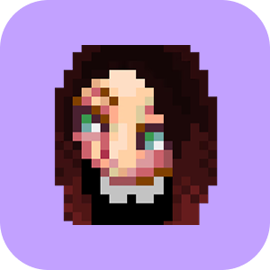

<picture>
  <source media="(prefers-color-scheme: dark)" srcset="readme.png">
  <source media="(prefers-color-scheme: light)" srcset="readme.png">
  
</picture>

### Olá, me chamo Kerou 👋

 Sou Product Designer e estou estudando desenvolvimento desde janeiro de 2024. 

 🖌️ Gosto de jogos e de fazer pixel art. 

 👋 Entre em contato pelos links: 

  
  
